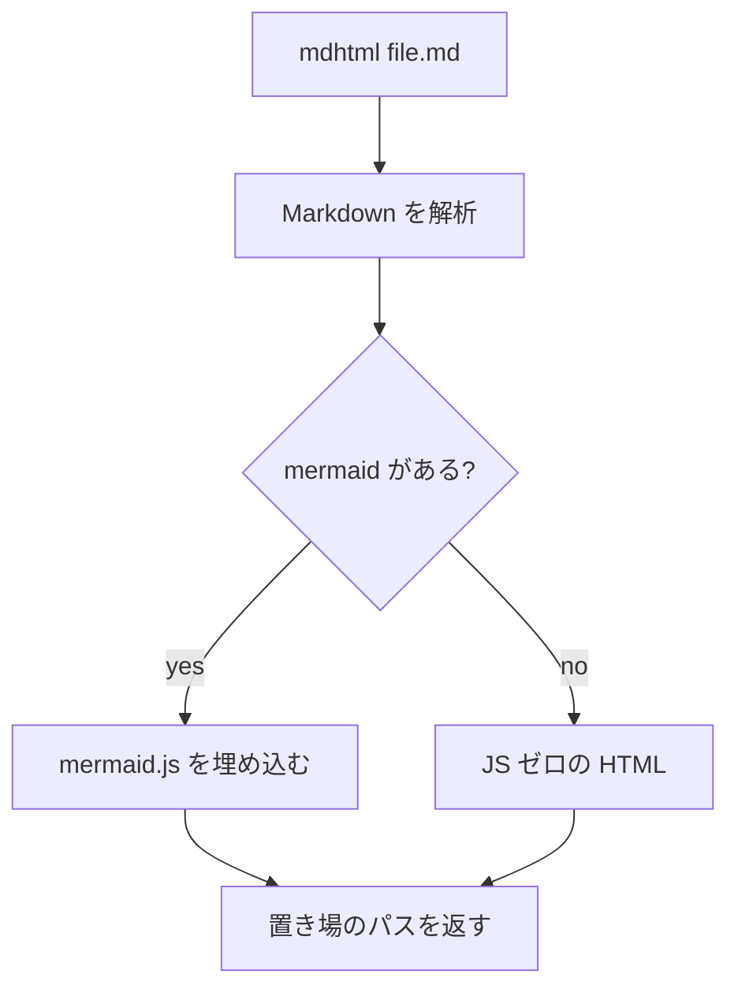
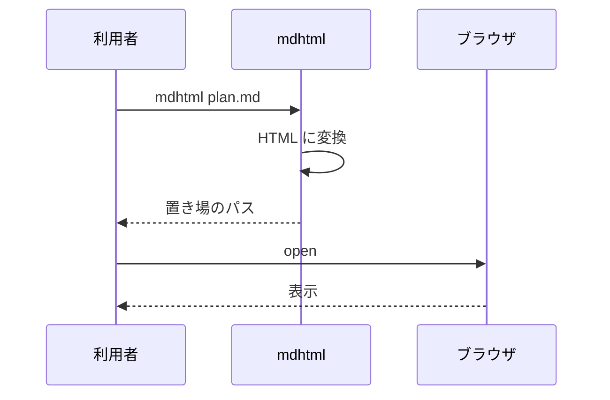

# Mermaid の確認

図の前の本文。図の描画を待たずにこれが先に見えること。


```mermaid
flowchart TD
    A[mdhtml file.md] --> B[Markdown を解析]
    B --> C{mermaid がある?}
    C -->|yes| D[mermaid.js を埋め込む]
    C -->|no| E[JS ゼロの HTML]
    D --> F[置き場のパスを返す]
    E --> F
```

図と図のあいだの本文。


```mermaid
sequenceDiagram
    participant U as 利用者
    participant M as mdhtml
    participant B as ブラウザ
    U->>M: mdhtml plan.md
    M->>M: HTML に変換
    M-->>U: 置き場のパス
    U->>B: open
    B-->>U: 表示
```

通常のコードブロックは今までどおりハイライトされる。

```rust
let x = 1;
```
